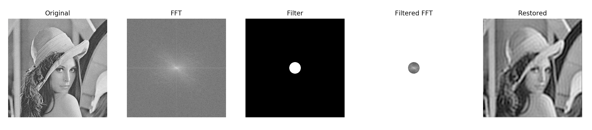
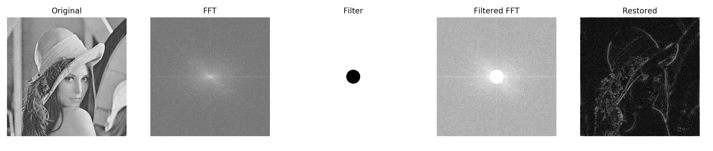
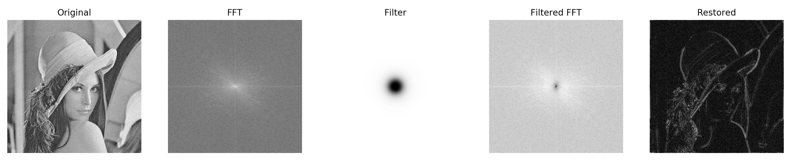
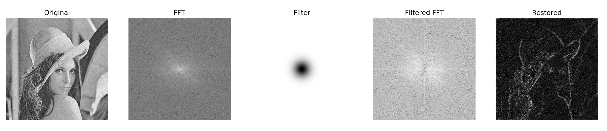

# Report - Assignment 2

**Student:** Gustavo Aguilar, 1543171
 
 ## Exercise 1
 
 ### a) Forward Fourier Transform
 
 I implemented the inefficient version of the FFT (i.e., with a complexity of `O(n^2)`). 
 Although there is possible to perform `O(n log n)`, this is the most straighforward way 
 to implement it. For a given `(x, y)` of the FFT, the implementation goes as follows:
 
```
(M, N) = matrix.shape
total = 0
for m in range(M):
    for n in range(N):
        period   = (x * m / M) + (y * n / N)
        exponent = -2j * np.pi * period
        result   = matrix[m, n] * np.exp(exponent)
        total += result
return total
```
* `matrix` contains the values of the input image
* `(M, N)` are the dimensions of the input image
* `(x, y)` are the coordinates of the value being calculated
* `exponent` is accounting for the cosine and sine values of the FFT
* `total` is the sum of the computations and the returning value
 
### b) Inverse Fourier Transform

The implementation of the IFFT is pretty similar to the FFT. The differences rely in that
the exponent is not negative in this case. The other difference is that the summation at the
end of the loops is divided by the product of the dimensions of the input matrix. The variables
of the following implementation play the same role as before:

```
(M, N) = matrix.shape
total = 0
for m in range(M):
    for n in range(N):
        period   = (x * m / M) + (y * n / N)
        exponent = 2j * np.pi * period
        result   = matrix[m, n] * np.exp(exponent)
        total += result
return total / (M * N)
```
 
 ### c) Discrete Cosine Transform
 
 I calculated this passing the input matrix to the FFT function, and then taking the real part of 
 the output matrix. The real part of the matrix accounts for the cosine signal, whereas the imaginary
 part of the matrix represents the sine signal.
 
 ### d) Magnitude of the Fourier Transform
 
I calculated the magnitude of the FFT as follows:
 
```
real = mat[i, j].real ** 2
imag = mat[i, j].imag ** 2 

magnitude = (real + imag) ** 0.5
```

 ### _Note_
    
While implementing these functions, I added unit test for each of them. They comepare the results
against the outputs of built-in or library functions. You can run those test by executing the DFT.py file directly 


## Exercise 2

### Filtered Image Flow:

I used built-in functions to generate the filtered image. For that, I use the following steps 
regardless of the pass filter being applied:

* Generate the FFT, and shift it to have the low frequences in the center
* Create the filter matrix (of the same size of the FFT) and multiply it by the shifted FFT
* The previous output contains the filtered image, for which I applied the inversed shift and IFFT
* I fully stretched the resulting image 

### Pass Filters 

The implementation of the filters is exactly the same formula as seen in class. The only details that 
worth mention are the following:
* I created a x and y arrays of linearly distributed values as follows:
    ```
    x = np.linspace(-0.5, 0.5, self.image.shape[0])  * rows
    y = np.linspace(-0.5, 0.5, self.image.shape[1])  * cols
    ```
* Get the distance matrix from the previous axis vectors
* Create a filter matrix of the size of the image full of ones
* Set the values of the filter matrix according to the equation of the filter being applied and using the radius matrix
* Use the resulting filter matrix within the previous flow


#### Results

All the results have been run with `cutoff = 30` and `order = 2` (for butterworth).   

Ideal Low Pass Filter:


Ideal High Pass Filter:


Butterworth Low Pass Filter:


Butterworth High Pass Filter:


Gaussian Low Pass Filter:


Gaussian High Pass Filter:



### _Note_

I provide the tools I used for debugging the implementation:
* For the visualization of all the flows in one figure, uncomment the `debug` function in `filtering()`
* For the visualization of the image being generated uncomment the following lines in the `filtering()` function
    ```
    self.add_subplot(1, 5, range(1, 6), fft_orig, filt, fft_new, restored)
    plt.show()
    ```
